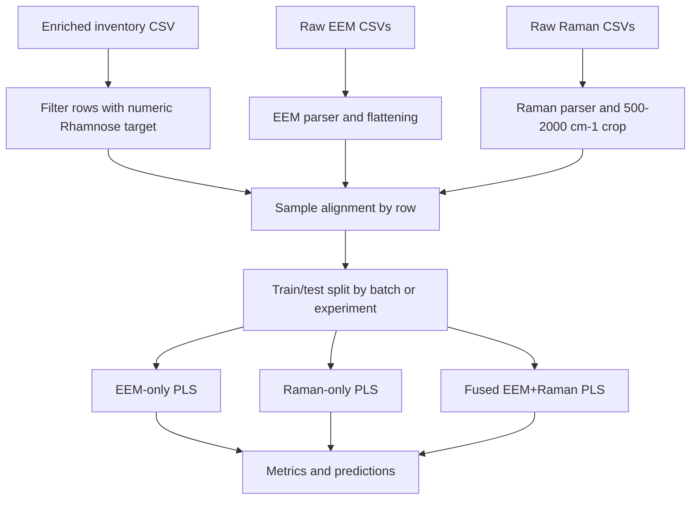

# Training Pipeline

## High-Level Flow



## Input-Output Explanation

### Inputs per sample

- `EEM`: excitation-emission intensity matrix
- `Raman`: intensity spectrum from `500-2000 cm^-1`
- metadata: experiment, plate, well, batch
- target: numeric HPLC Rhamnose concentration

### Outputs per sample

- predicted Rhamnose concentration
- residual = actual - predicted
- model provenance: `eem`, `raman`, or `fusion`

## Feature Construction

### EEM

```text
raw CSV
  -> parse matrix
  -> convert OVER to NaN
  -> keep intensity block only
  -> flatten to 1D feature vector
```

### Raman

```text
raw CSV
  -> parse shift and intensity columns
  -> crop to 500-2000 cm^-1
  -> keep intensity values on the observed grid
```

## Baseline Model

The initial baseline is **Partial Least Squares Regression**:

- good for high-dimensional spectroscopy data
- robust to multicollinearity
- interpretable compared with deeper models

## Recommended Progression

1. Establish the PLS baseline.
2. Compare `EEM`, `Raman`, and `Fusion`.
3. Add preprocessing variants.
4. Only then test tree models or neural multimodal models.
